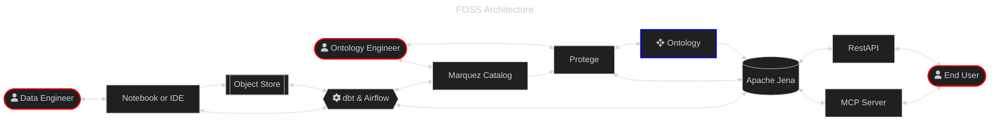
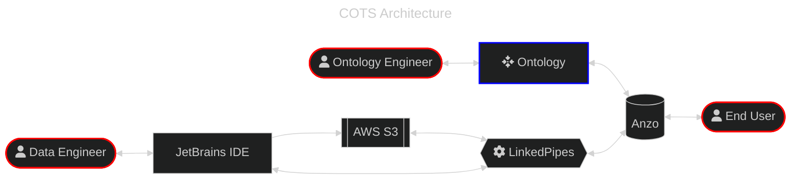
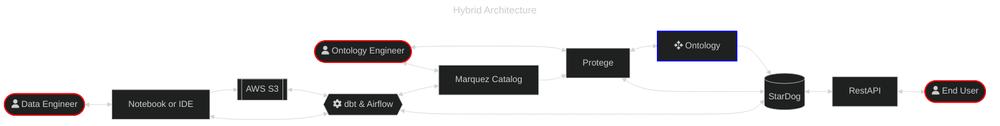
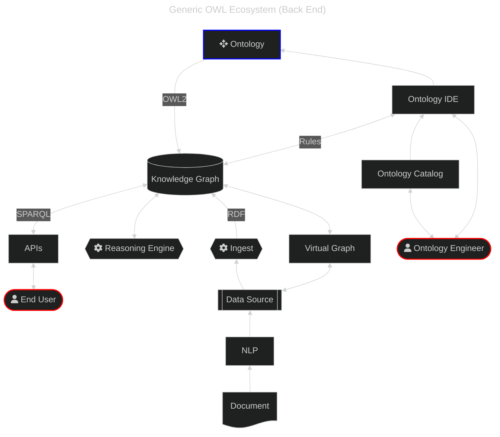
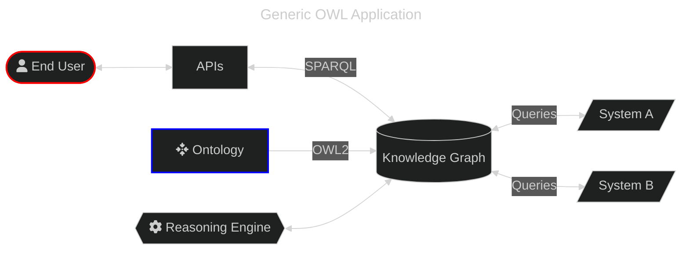

# Architectures

## DoD/IC Ontology Working Group - Operationalizing Ontologies Community of Interest

**Contributors:** Paul Kogut, Don Pellegrino, Jonathan Vajda, John Beverley, Joe Blankenship, Eric Peterson, Tim Toohill, Jennifer DeCamp, Ali Hasanzedah, John Judkins, Amanda Mitchell

## Introduction

The goal of the Operationalizing Ontologies Community of Interest (OO-COI) is to provide guidance on how to apply ontologies in DoD/IC operational systems (e.g., C2, ISR, mission planning, equipment maintenance, logistics) and internal business systems. Current guidance is scattered across many sources and has significant gaps. The intended audience is both non-technical mission-focused personnel and very technical developers. Education of project managers, software architects, and junior software developers is a major barrier to fully leveraging the benefits of ontologies. The OO-COI will help DoD/IC personnel identify opportunities to insert ontologies into current and future systems.

This document provides guidance on data architectures and their assemblage based on the ontology application. This guidance will not cover every possible scenario, but provides a sufficient baseline for conceptualization and implementation of these architectures.

> [!NOTE]
> This document assumes use of DoD/IC Foundry-compliant semantic infrastructure that includes OWL2, RDF, and SPARQL for most situations encountered by this CoI (see Guidance for Ontology-based Systems Development).

## Key Architecture Considerations

Before building your architecture, consider the most fundamental aspects of the system: its core functionality and scope of operation.

* Cost - A complex factor in building these ontology systems may be the budget for tools, personnel, and infrastructure. A budget should always be created and updated for an architecture to ensure long-term planning and persistence of the solution.
* Location - Geographic factors may affect what can and cannot be done for an architecture solution. This consideration takes into account what infrastructure and personnel are available to implement and maintain a solution in addition to the controls and regulations necessary to ensure compliance and security for the architecture. In the case of cloud and hybrid deployments, this also takes into account regional and multi-regional deployements.
* Infrastructure - The space in which the architecture will be implemented is often a complicated challenge. This challenge is greatly simplified with clean requirements for the infrastructure based on the scope of the architecture. Care should be taken to define infrastructure requirements before architecture implementation.
* Personnel - Despite the increasing number of AI solutions to assist with architecture implementation and maintenance, skilled personnel will still be necessary to augment and evolve the architecture to meet the present and future challenges for a given project. Budget and regulation should take into account the strategic need for these skilled personnel when scoping and architecture solution.
* Controls - When considerting the convergent space of personnel and technical tasks, clear lanes and deadlines should be established in the requirements for an architecture solution. These requirements should outline roles and responsibilities to encapsultate all essential operational tasks necessary to perpertuate the architecture throughout its lifecycle.
* Limitations - A clean understanding of what the architecture can and cannot do should be established before the implementation. This allows key stakeholders, champions, and engineers to understand the limitations of the system as well as what the system can do best to enable KPIs and strategic goals.
* Security - The architecture or its infrastructure may have several security considerations which may affect the functionality of the planned solution. Ensure that security factors such as access control, group policy, and classification are scoped thoroughly prior to finalization of planning and implementation.
* Regulations - Depending on the market or political boundaries in which an architecture is to be built, there may be hundreds of regulatory factors that affect your decisions on the final architecture solution. Consult with stakeholder, leadership, champions, and legal staff to aid in the scope, limitations, and controls for the architecture.

## Generic Architectures for Ontology applications

Operationalizing ontologies involves the nexus of tools, patterns, and processes to realize the integration of ontology practices. This integration can take many shapes to answer several challenges, leading to a need for flexibility in architecture composition for groups of people with varying levels of infrastructure and tool access.

Each architecture must facilitate access to the different levels of ontology artifact:

* Upper- or Top-level ontology access to Basic Formal Ontology (BFO)
* Mid-level or domain ontology access to Common Core Ontology (CCO) and other BFO-compliant ontology
* Instance- or application-ontology access to specific data instances of domain entities

Additionally, users will have different system access and control levels. As a result, architecture designs will be scoped across three overlapping categories of Internet access and security policy:

* Open-source architecture with custom code to bridge the gaps in data and tooling
* Hybrid architecture consisting of open-source, custom code, and commercial-off-the-shelf (COTS) tools
* COTS/GOTS architecture with minimal/no custom code

> [!NOTE]
> The term `custom code` is broadly defined as any software that is created to bridge the functional gaps between other tools. This can include high-level programming languages, domain-specific languages (DSLs), data-definition languages (DDLs), or other languages used to facilitate the input/output of tools and their respective processes.

Finally, each ontology project will have their unique ecosystem into which valid ontologies will be implemented. This document and CoI will focus on varying implementations of OWL2 RDF via W3C.

### FOSS Architecture

A baseline for ontology and data engineering can be accomplished with open-source software and minimal specification hardware. For ontology engineers, there are several ontology editor and catalog solutions on there optimized for manipulation and storage of RDF or tabular metadata objects for ontology creation and curation. The ontologies can be stored in any number of open graph databases depending on the preference for triple store, property graph, or other relationship/query paradigms. The data engineers also have a number of traditional or AI-enabled editor for programming pipelines for data and metadata assets, optimizing for repeatable processing and horizontally-scalable task orchestration. File system or object store can be used as a repository for the engineers' assets, enabling change data capture (CDC), version control, and lineage for ontology and data processes. The end user can in turn directly access these assets with appropriate and secure RBAC or preferrably through secure API endpoints.

### COTS Architecture

Commercial of the Shelf (COTS) technologies can enable quick and well-supported solutions for ontology engineers seeking to accelerate their efforts while integrating their work with other team efforts.

### Hybrid Architecture

### Generic OWL Ecosystem architectures

The diagram below shows a generic OWL backend architecture. Structured and unstructured text data can be ingested into the knowledge graph to support queries of heterogeneous sources.

The diagram below shows a generic OWL application architecture. Applications like those listed in the sections above can query a knowledge graph. Pre-existing services or systems A and B can interoperate via a shared ontology that contains mappings between classes and properties.

## Integrating OWL, RDF, and SPARQL in a Modern Microservice Architecture

Microservices architectures are the latest attempt to build flexible systems and reusable code. There is no formal widely accepted definition of microservices architectures but they generally have these characteristics:

* Loosely coupled and fine-grained services with minimized dependencies
* Services have well-defined “public” APIs
* The architecture is designed to accommodate services implemented in multiple programming languages and services that use different data stores
* Emphasis on independent deployment with containers
* Associated with cloud architectures and DevOps processes
* Microservices can be combined into composite services

The goals of microservice architectures and OWL ecosystems are not fundamentally incompatible. Interoperability is central to both. They diverge in their implementations of semantics. Technology often used in microservices architectures includes:

* **JSON**: Used for serializing and transmitting structured data between microservices. JSON is primarily syntax. JSON schema adds some semantics similar to XML schema.
* **JSON LD**: An extension of JSON to add semantics similar to RDF. This is a promising bridge between microservices and OWL ecosystems.
* **REST**: Widely used service-oriented architecture protocol that usually transmits data as JSON or XML.
* **OpenAPI**: Defines REST APIs and is a standard programming language-agnostic interface description for HTTP APIs, allowing both humans and computers to discover and understand the capabilities of a service without requiring access to source code.
* **gRPC**: A more recent service-oriented architecture protocol that transmits data as serialized binary. Uses protocol buffers to define contracts with datatypes.
* **Docker**: Used to define containers for microservices.
* **Kubernetes**: Used to execute and monitor containers such as Docker. Helm charts allow you to configure Kubernetes.
* **ActiveMQ**: Supports both point-to-point and publish/subscribe messaging. In microservices architectures, publish/subscribe messaging is often used for asynchronous communication. Producer services define topics and consumer services listen to topics.

The microservice architecture technologies described above create a major barrier to the adoption of OWL, RDF, and SPARQL-based architectures that support formal semantics and automated reasoning. It is difficult to explain why the OWL ecosystem should be used instead of JSON. If you have the luxury of building a set of microservices from scratch, then an OWL ecosystem like that shown in the diagram above is highly recommended. The major challenge comes when there are existing services and applications that are not ontology-based. In this case, you need to resort to custom translators.

> [!NOTE]
> This is a complex subject and there is no widely accepted solution yet. The W3C is working on this topic (see: [W3C JSON-LD Best Practices](https://w3c.github.io/json-ld-bp/)).
